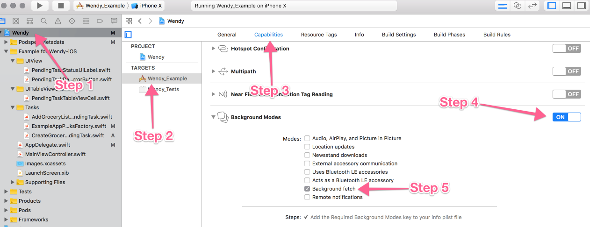

[](http://cocoapods.org/pods/Wendy)
[](http://cocoapods.org/pods/Wendy)
[](http://cocoapods.org/pods/Wendy)


# Wendy

Remove the difficulty in making offline-first iOS apps. Sync your offline device storage with remote cloud storage easily. When building offline-first mobile apps, there are *lots* of use cases to think about. Wendy takes care of handling them all for you!


Android developer? [Check out the Android version of Wendy!](https://github.com/levibostian/wendy-android)

## Announcement 

See [latest announcement](https://github.com/levibostian/Wendy-iOS/discussions/51) from maintainers discussing API changes coming to Wendy. 

## What is Wendy?

Wendy is an iOS library designed to help you make your app offline-first. Use Wendy to define sync tasks, then Wendy will run those tasks periodically to keep your app's device offline data in sync with it's online remote storage.

Wendy is a FIFO task runner. You give it tasks one by one. Wendy persists those tasks to storage. Then, when Wendy has determined it's a good time for your task to run, it will call your task's sync function to perform a sync. Wendy goes through all of the tasks available one by one running them to succeed or fail and try again.

*Note: Wendy is currently in an alpha stage. The API most definitely could change and breaking changes will come in future releases. It is used in production apps today. Use the latest release of Wendy as you wish but be prepared for having to update your code base in future releases.*

## Why use Wendy?

When creating offline-first mobile apps there are 2 tasks you need to do in your code. 1. Persisting data to the user's iOS device storage and 2. Sync that user's storage with remote online storage.

Wendy helps you with item #2. You define how the local storage is supposed to sync with the remote storage and Wendy takes care of running those tasks for you periodically when the time is right.

Wendy currently has the following functionality:

* Wendy uses the iOS background fetch scheduler API to run tasks periodically to keep data in sync without using the user's battery too much.
* Wendy is not opinionated in your network and data storage model. You may use whatever method you choose to sync data with it's remote storage and whatever method you choose to store data locally on the device. Wendy works with your workflow you already have. Store user data in Core Data locally and a Rails API for the cloud storage. Store user data in Realm locally and a Parse server for the cloud storage. Use just NSUserDefaults and GraphQL. Whatever you want, Wendy works with it.
* Dynamically allow and disallow tasks to sync at runtime. Wendy works in a FIFO style with it's tasks. When Wendy is about to run a certain task, it always asks the task if it is able to run.
* Group tasks together to enforce they all run (and succeed) in an exact order from start to finish.

# Install

Wendy-iOS is available through [CocoaPods](http://cocoapods.org). To install it, simply add the following line to your Podfile:

```ruby
pod 'Wendy', '~> version-here'
```

(replace `version-here` with [](http://cocoapods.org/pods/Wendy))

*Note:* It is recommended to specify the version code in your Podfile (as done above) for Wendy as Wendy is in `alpha` stage of development. The API will more then likely change and have broken changes on releases until beta and stable releases come out. The latest version at this time is: [](http://cocoapods.org/pods/Wendy)

# Getting started

For this getting started guide, lets work through an example for you to follow along with. Let's say you are building a grocery list app. We will call it, `Grocery List`.

First, create a `PendingTasksFactory` subclass that stores all of your app's Wendy `PendingTask`s. It's pretty blank to start but we will add more to it later. ([I plan to remove this requirement in the future](https://github.com/levibostian/Wendy-Android/issues/17). PRs welcome 😄)

```swift
import Wendy

class GroceryListPendingTasksFactory: PendingTasksFactory {

    func getTask(tag: PendingTask.Tag) -> PendingTask {
        switch tag {      
        default: 
            fatalError("Forgot case with tag: \(tag)")
        }
    }

}
```

Add the following code to your `AppDelegate`'s `application(_ application: UIApplication, didFinishLaunchingWithOptions launchOptions: [UIApplicationLaunchOptionsKey: Any]?) -> Bool` function:

```swift
func application(_ application: UIApplication, didFinishLaunchingWithOptions launchOptions: [UIApplicationLaunchOptionsKey: Any]?) -> Bool {  
    Wendy.setup(tasksFactory: GroceryListPendingTasksFactory())
    #if DEBUG
    WendyConfig.debug = true
    #endif

    return true
}
```

(check [this out](https://stackoverflow.com/a/30013587/1486374) if you don't know how to get `#if DEBUG` working in your app)

Wendy is now configured. It's time to use it!

For each separate task that you need to sync local storage with remote cloud storage, you define a `PendingTask` subclass.

In our Grocery List app, we want to allow users to create new grocery items. Every time that a user creates a new grocery list item, we don't want to show them a progress bar saying, "Saving grocery list item..." while we perform an API call! We want to be able to *instantly* save that grocery list item and sync it with the cloud storage later so our user can get on with their life (can't you just see your App Store reviews going up, up, up right now? ⭐⭐⭐⭐⭐).

Let's create our first `PendingTask` subclass for creating new grocery items.

```swift
import Wendy

class CreateGroceryListItemPendingTask: PendingTask {

    static let tag: Tag = String(describing: CreateGroceryListItemPendingTask.self)

    var taskId: Double?
    var dataId: String?
    var groupId: String?
    var createdAt: Date?

    convenience init(groceryStoreItemId: Int) {
        self.init()
        self.dataId = String(groceryStoreItemId)
    }

    func isReadyToRun() -> Bool {
        return true
    }

    func runTask(complete: @escaping (Error?) -> Void) {
        // Here, instantiate your dependencies, talk to your DB, your API, etc. Run the task.
        // After the task succeeds or fails, return to Wendy the result.

        let groceryStoreItem = localDatabase.queryGroceryStoreItem(self.dataId)

        performApiCall(groceryStoreItem, complete: { apiCallResult in
            complete(apiCallResult.error)            
        })
    }

}
```

Each time that you create a new subclass of `PendingTask`, you need to add that to the `PendingTasksFactory` you created. Your `GroceryListPendingTasksFactory` should look like this now:

```swift
import Wendy

class GroceryListPendingTasksFactory: PendingTasksFactory {

    func getTask(tag: PendingTask.Tag) -> PendingTask {
        switch tag {
        case CreateGroceryListItemPendingTask.tag: return CreateGroceryListItemPendingTask()
        default: 
            fatalError("Forgot case with tag: \(tag)")
        }
        }
    }

}
```

Just about done.

Let's check out the code you wrote in your Grocery List app when your users want to create a new grocery store item in the app.

```swift
func createNewGroceryStoreItem(itemName: String) {
    // First thing you need to do to make a mobile app offline-first is to save it to the device's storage.
    // Below, we are saving to a `localDatabase`. Whatever that is. It could be whatever you wish. Core Data, Sqlite, Realm, Keychain, NSUserDefaults, whatever you decide to use works. After we save to the database, we probably get an ID back to reference that piece of data in the database. This ID could be the key in NSUserDefaults, the database row ID, it doesn't matter. Simply some way to identify that piece of data *to query later* in your PendingTask.
    let id: Int = localDatabase.createNewGroceryStoreItem(itemName)

    // We will now create a new `CreateGroceryListItemPendingTask` pending task instance and give it to Wendy.
    let pendingTaskId: Double = Wendy.shared.addTask(CreateGroceryListItemPendingTask(groceryStoreItemId: id))

    // When you add a task to Wendy, you get back an ID for that new `PendingTask`. It's your responsibility to save that ID (or ignore it). It's best practice to save that ID with the data that this `PendingTask` links to. In our example here, the grocery store item in our localDatabase is where we should save the ID.
    localDatabase.queryGroceryStoreItem(id).pendingTaskId = pendingTaskId

    // The reason you may want to save the ID of the `PendingTask` is to assert that it runs successfully. Also, you can show in the UI of your app the syncing status of that data to the user. This is all optional, but recommended for the best user experience.
    WendyConfig.addTaskStatusListenerForTask(task.taskId!, listener: self) // View the extension code below.     
}

extension View: PendingTaskStatusListener {

    func running(taskId: Double) {
        self.text = "Running"
    }

    func complete(taskId: Double, successful: Bool) {
        self.text = successful ? "Success!" : "Failure"
    }

    func skipped(taskId: Double, reason: ReasonPendingTaskSkipped) {
        self.text = "Skipped"
    }

}

```

The very last step. Getting Wendy to run your tasks periodically.

In XCode, follow these steps below to enable the background fetch capability for your app:



In your `AppDelegate`, you will now need to run Wendy from the background fetch function. Below is an example of that:

```swift
func application(_ application: UIApplication, performFetchWithCompletionHandler completionHandler: @escaping (UIBackgroundFetchResult) -> Void) {
    let backgroundFetchResult = Wendy.shared.performBackgroundFetch()
    completionHandler(backgroundFetchResult.backgroundFetchResult)
}
```

The only requirement is to call `Wendy.shared.performBackgroundFetch()`. You may decide to ignore Wendy's result from this function is you wish and you need to run more in this function. If you decide to, Wendy does parse the background fetch result for you: `backgroundFetchResult.backgroundFetchResult`.

Done! Wendy takes care of all the rest. Wendy will try to run your task right away but if you're offline or in a spotty Internet connection, Wendy will wait and try again later.

There is a document on [best practices when using Wendy](BEST_PRACTICES.md). Check that out to answer your questions you have about why Wendy works the way that it does. The document's code is Android code, but it's not about the code, it's about the best practices so you should be able to understand it until I get a better "generic" document setup 😄.

## Clear data

If you have the scenario ever happen where, for example, the user of your app logs out of your app. The scenario where you usually delete all of the data on the device for your app. You can clear all of Wendy's data:

```swift
Wendy.shared.clear()
```

*Note: If a `PendingTask` is currently being executed while you call `clear()`, that task will finish executing.*

# Testing

Wendy was built with unit/integration/UI testing in mind. Here is how to use Wendy in your tests:

## Write unit tests against `PendingTask` implementations

Your implementations of `PendingTask` should be no problem to test. `PendingTask` is just a protocol. You can unit test your implementation using dependency injection, for example, to test all of the functions of `PendingTask`.

## Write unit tests for code that depends on Wendy classes

When writing tests against code Wendy classes such as `PendingTasksRunnerResult`, Wendy allows you to create instances of these internal classes with the convenient `.testing.` property added to these internal classes. 

Here are some examples:

```swift
PendingTasksRunnerResult.testing.result(from results: [TaskRunResult])
WendyUIBackgroundFetchResult.testing.get(runnerResult: PendingTasksRunnerResult)
```

## Write integration tests around Wendy 

Coming soon! 

You may be able to do this already, but it has not been tested. A good place to start would be clear Wendy before each test and use it like normal. See where that takes you. Report issues as you encounter them. 

## Example

To run the example project, clone the repo, and run `pod install` from the `Example/` directory first. Then, open XCode and run the project.

## Install template files

Wendy comes with some XCode template files to create `PendingTask`s and `PendingTaskFactory`s very quickly within XCode from the File > New File menu.

All you need to do is run this bash script to install the scripts on your machine in the XCode templates directory:

```bash
./Pods/Wendy/Templates/install_templates.sh
```

Restart XCode if it is currently open on your machine.

Then, the next time you open XCode and go to "New file", you will see a section called "Wendy" with file templates inside!

## Documentation

Wendy currently *does not* have full code documentation. It is planned to have full documentation generated via jazzy in the near future.

Until then, the best thing to do is:

* Read this README on how to get started.
* Wendy-Android has [full documentation created for it](https://levibostian.github.io/Wendy-Android/wendy/). If you are wondering how a specific function works, you may be able to learn there. *Warning: Wendy-Android and Wendy-iOS are kept up to date between one another as soon as possible. When a bug is fixed on one, the other gets the same bug fixed on it as well. However, it may take a day or two for this sync to happen by the contributors. With that in mind, the documentation might be a tad bit off between the libraries.*
* [Contact that author, Levi, on Twitter](https://twitter.com/levibostian/).

## Configure Wendy

Use the class `WendyConfig` to configure the behavior of Wendy.

* Register listeners to Wendy task runner.

```swift
WendyConfig.addTaskRunnerListener(listener: listener)
```

* Register listeners to a specific Wendy `PendingTask`.

```swift
WendyConfig.addTaskStatusListenerForTask(taskId: pendingTaskId, listener: listener)
```

* Have Wendy log debug statements as it's running during development.

```swift
WendyConfig.debug = true # default is false.
```

I recommend doing the following:

```swift
#if DEBUG
WendyConfig.debug = true
#endif
```

## Maintainers 

* Levi Bostian - [GitHub](https://github.com/levibostian)


## License

Wendy-iOS is available under the MIT license. See the LICENSE file for more info.

## Contribute

Wendy is open for pull requests. Check out the [list of issues](https://github.com/levibostian/wendy-ios/issues) for tasks I am planning on working on. Check them out if you wish to contribute in that way.

**Want to add features to Wendy?** Before you decide to take a bunch of time and add functionality to the library, please, [create an issue](https://github.com/levibostian/Wendy-iOS/issues/new) stating what you wish to add. This might save you some time in case your purpose does not fit well in the use cases of Wendy.

Follow the steps below to compile the Wendy project on your machine for contributing!

* Open up the `Example/Wendy.xcworkspace` in XCode.
* Compile the project in XCode.

# Credits

Header photo by [Allef Vinicius](https://unsplash.com/photos/FPDGV38N2mo?utm_source=unsplash&utm_medium=referral&utm_content=creditCopyText) on [Unsplash](https://unsplash.com/search/photos/red-head?utm_source=unsplash&utm_medium=referral&utm_content=creditCopyText)
