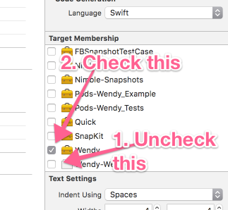

# Wendy

[](https://travis-ci.org/Levi Bostian/Wendy-iOS)
[](http://cocoapods.org/pods/Wendy-iOS)
[](http://cocoapods.org/pods/Wendy-iOS)
[](http://cocoapods.org/pods/Wendy-iOS)

## Example

To run the example project, clone the repo, and run `pod install` from the Example directory first.

## Requirements

## Installation

Wendy-iOS is available through [CocoaPods](http://cocoapods.org). To install
it, simply add the following line to your Podfile:

```ruby
pod 'Wendy'
```

....instructions coming soon for what to do here....(check out [Wendy-Android's instructions](https://github.com/levibostian/wendy-android) in the mean-time as they are identical pretty much)

Turn on the "Background Fetch" capability in your app. Then, in your AppDelegate, add the following code:

```
func application(_ application: UIApplication, performFetchWithCompletionHandler completionHandler: @escaping (UIBackgroundFetchResult) -> Void) {
    let backgroundFetchResult = Wendy.shared.backgroundFetchRunTasks(application, performFetchWithCompletionHandler: completionHandler)
    completionHandler(backgroundFetchResult.backgroundFetchResult)
}
```

## Install template files

Wendy comes with some XCode template files to create `PendingTask`s and `PendingTaskFactory`s very quickly within XCode from the File > New File menu.

All you need to do is run this bash script to install the scripts on your machine in the XCode templates directory:

```
./Pods/Wendy/Templates/install_templates.sh
```

Restart XCode if it is currently open on your machine.

Then, the next time you open XCode and go to "New file", you will see a section called "Wendy" with file templates inside!

## Building

Follow the steps below to compile the Wendy project on your machine for contributing!

* Open up the `Example/Wendy.xcworkspace` in XCode.
* Navigate to: `Pods > Development Pods > Wendy > Resources > Wendy.xcdatamodeld` in the project navigator, select `Wendy.xcdatamodeld`. In XCode, select `View > Utilities > Show file inspector` from the menu. In the sidebar on the right that shows up, make sure that the target membership for this `Wendy.xcdatamodeld` file is correct:



* In the project explorer, select the `Pods` target. Then, select the `Pods` project. Lastly, select `Build settings`. Type in the search bar, `SWIFT_V`. You will see the `Swift Language Version` is set to `Unspecified`. Select the dropdown and select `Swift 4.1`.
* Select the `Wendy_Example` scheme that is shared in the project.
* Compile the project in XCode.

## Author

Levi Bostian, levi.bostian@gmail.com

## License

Wendy-iOS is available under the MIT license. See the LICENSE file for more info.
